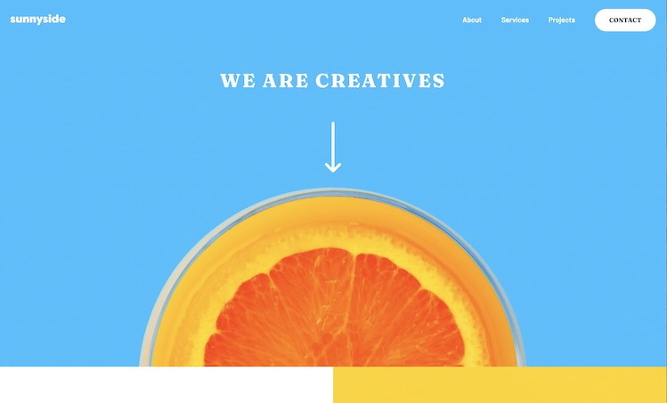

# Frontend Mentor - Sunnyside agency landing page solution

This is a solution to the [Sunnyside agency landing page challenge on Frontend Mentor](https://www.frontendmentor.io/challenges/sunnyside-agency-landing-page-7yVs3B6ef). Frontend Mentor challenges help you improve your coding skills by building realistic projects.

## Table of contents

- [Overview](#overview)
  - [The challenge](#the-challenge)
  - [Screenshot](#screenshot)
  - [Links](#links)
- [My process](#my-process)
  - [Built with](#built-with)
  - [What I learned](#what-i-learned)
  - [Useful resources](#useful-resources)
- [Author](#author)

## Overview

### The challenge

Users should be able to:

- View the optimal layout for the site depending on their device's screen size
- See hover states for all interactive elements on the page

### Screenshot

### Links

<!-- - Solution URL: [Add solution URL here](https://your-solution-url.com) -->
- Live Site URL: [sunnyside-agency-matthiassmith.vercel.app/](https://sunnyside-agency-matthiassmith.vercel.app/)

## My process
### Built with

- NextJS
- ReactJS
- Tailwind CSS
- Semantic HTML5 markup
- CSS Grid
- Mobile-first workflow
- CSS-in-JS

### What I learned

For this project, I wanted to try out using Tailwind CSS. I decided to build the page twice so that I could really get a feel for how much time Tailwind might save me. So I first built the site using just HTML/CSS and a tiny amount of JS for the mobile nav menu, and I used the BEM naming convention for styling. Then I built it again but tried to use only Tailwind for styling.

Tailwind surprised me here. I've already used other CSS libraries and often use a few of my own utility-first CSS classes in projects to remain DRY. But the extent to which I only needed to add a few custom CSS snippets to specific things like the "Learn More" link's colored underlines blew me away. Add to that the fact that there were no opinions about how I should structure my HTML (looking at you Bootstrap) made using this CSS library feel like a breath of fresh air.

Tailwind's documentation is also really great. It's to the point and easily searchable. I was able to find everything I needed within seconds.

I would happily use Tailwind again with other similar projects and look forward to seeing how much time I might save from repeatedly writing utility classes for each project.

### Useful resources
- [Tailwind CSS](https://tailwindcss.com/)
- [NextJS](https://nextjs.org/)
## Author

- Website - [Matthias Smith](https://portfolio-matthiassmith.vercel.com)
- Frontend Mentor - [@MatthiasSmith](https://www.frontendmentor.io/profile/MatthiasSmith)
- Twitter - [@matthiasdev](https://twitter.com/matthiasdev)
